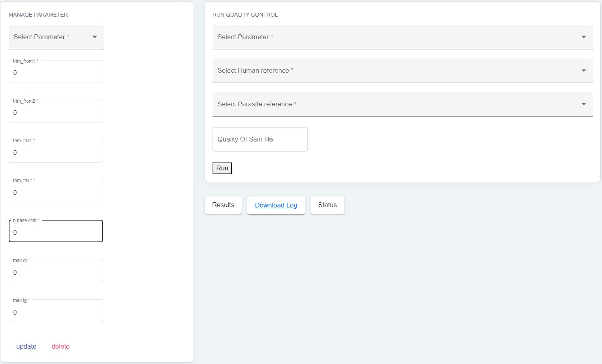
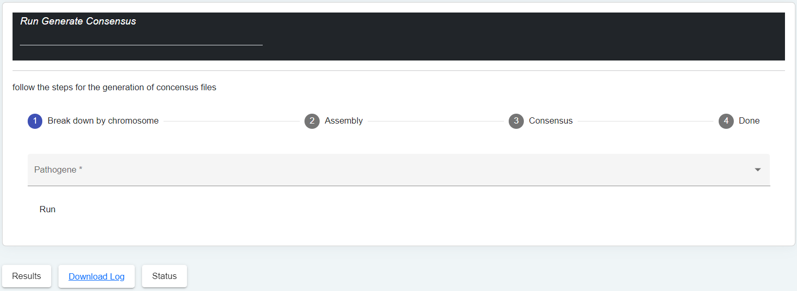

Analyses des échantillons 
=========================

.. rubric:: Manage samples 
 
.. strong:: Importer les fichiers

La session "Manage Samples" permet, comme son nom l'indique, de charger les fichiers dans différents dossiers en fonction du traitement à effectuer. Dans le répertoire "Files to All Step", les fichiers chargés pourront être disponibles dans toutes les analyses. Ce répertoire peut contenir tous les types de fichiers générés par le séquençage de l'ADN tels que les fichiers en Fastq, Fq, en Fastq.gz ou Fq.gz.

Le dossier "Files to Run Double Filtering" ne doit contenir que des fichiers en Fq.gz pour pouvoir effectuer la double soustraction. Quant au dossier "Files to Generate De Novo", il ne doit contenir que des fichiers en Fastq pour pouvoir effectuer la génération de novo.

Cette organisation permet une gestion efficace des fichiers et évite les erreurs de traitement.

.. strong:: Le bouton FastQC

La session "Manage samples" de notre application offre une fonctionnalité intéressante pour visualiser les fichiers que vous avez chargés dans l'application, peu importe leur extension (que ce soit des fichiers paired-end ou single-end), grâce au bouton "FastQC". Ce dernier permet de traiter les fichiers que vous avez sélectionnés et de générer des fichiers HTML pour la visualisation des résultats.

Lorsque vous cliquez sur le bouton "FastQC", l'application va procéder à une analyse de la qualité des fichiers que vous avez sélectionnés, en utilisant l'outil FastQC. Les résultats seront ensuite compilés sous forme de fichiers HTML, qui pourront être visualisés directement dans votre navigateur web.

Cette fonctionnalité est particulièrement utile pour évaluer la qualité de vos données avant de les utiliser dans d'autres analyses, telles que l'assemblage de génome ou l'alignement de séquences. Elle vous permet de détecter rapidement les éventuels problèmes de qualité de vos fichiers, tels que des erreurs de séquençage ou une contamination par des séquences étrangères.

.. strong:: Le bouton MultiQC

Le bouton MultiQC disponible dans la session Manage Samples nous permet de générer des rapports d'analyse de qualité pour un ensemble de fichiers de données. Le fonctionnement de ce bouton est similaire à celui de FastQC. En effet, après avoir sélectionné les fichiers à traiter, le bouton MultiQC les analysera pour en extraire les informations de qualité. Il créera ensuite un rapport global qui présentera les résultats sous forme graphique pour une meilleure compréhension.

MultiQC est particulièrement utile pour la visualisation de résultats provenant de multiples échantillons ou de différentes plates-formes de séquençage. Il permet ainsi de générer des rapports comparatifs pour différentes analyses. Ce bouton peut être utilisé pour des analyses de RNA-Seq, de ChIP-Seq, de métagénomique, entre autres.

.. rubric:: Quality Control
 
.. image:: ../pictures/-21612.png
   :alt: Quality Control
   

La session Quality Control permet de nettoyer les échantillons avant de passer à l'étape suivante de l'analyse. Cette étape est cruciale car elle permet de s'assurer de la qualité des données avant de les utiliser pour des analyses plus poussées. Après avoir visualisé les fichiers avec FastQC et MultiQC, cette session permet de gérer différents paramètres (création, mise à jour et suppression) et de les rappeler pour traiter les fichiers chargés dans le dossier File to All Step.
Le bouton ''run'' exécute l'outil TrimGalore pour nettoyer les fichiers d'échantillons. TrimGalore est un outil de qualité qui est utilisé pour nettoyer les fichiers d'échantillons en éliminant les mauvais reads, en supprimant les duplicatas, etc. Il est conçu pour traiter les fichiers d'échantillons pair-end et permet de couper les mauvais reads.
La session Quality Control permet de garantir que les échantillons utilisés dans les analyses sont de la meilleure qualité possible en nettoyant les données brutes. Cela permet de s'assurer que les résultats obtenus par la suite seront fiables et précis.

.. rubric:: Double digital filtering

.. image:: ../pictures/-21642.png
   :alt: Double digital filtering
    
La session Double Digital Filtering consiste en effet à extraire le génome du pathogène d'intérêt à partir des échantillons provenant de l'hôte humain. Cela se fait en filtrant les séquences par paire-end pour éliminer les séquences de mauvaise qualité et en utilisant les génomes de référence déjà indexés depuis la session Genome de Références pour aligner les séquences sur le génome ciblé. Le résultat final de cette session est le fichier pathomapped contenant les pathogènes extraits de l'hôte qui ont bien mappé sur le génome du pathogène d'intérêt. Avant l'exécution du traitement de la session Double Digital Filtering, il est nécessaire de sélectionner dans les listes déroulantes l'hôte et le pathogène d'étude. Cela permet de s'assurer que le traitement est adapté aux spécificités de chaque étude et d'obtenir des résultats précis et fiables.
Pipeline
 
.. rubric:: Interface de la session pipeline

.. rubric:: Generate assembly and/or consensus.

