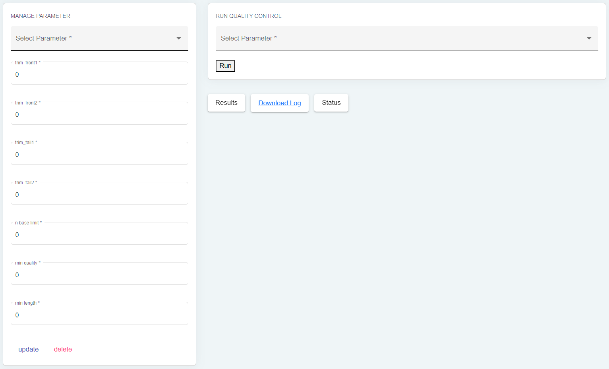

Sample Analysis
===============

.. rubric:: Manage samples 
 
.. strong:: Importing files

The "Manage Samples" session allows you to load files into different folders based on the desired analysis. In the "Files to All Step" directory, the loaded files will be available for all analyses. This directory can contain various file types generated from DNA sequencing, such as Fastq, Fq, Fastq.gz, or Fq.gz files.

The "Files to Run Double Filtering" folder should only contain Fq.gz files for performing double subtraction. As for the "Files to Generate De Novo" folder, it should only contain Fastq files for de novo generation.

This organization enables efficient file management and prevents processing errors.

.. strong:: The FastQC button

The "Manage Samples" session in our application offers an interesting feature to visualize the files you have loaded, regardless of their extension (whether paired-end or single-end files), using the "FastQC" button. This button processes the selected files and generates HTML files for result visualization.

When you click the "FastQC" button, the application will analyze the quality of the selected files using the FastQC tool. The results will be compiled into HTML files, which can be viewed directly in your web browser.

This feature is particularly useful for evaluating the quality of your data before using them in other analyses, such as genome assembly or sequence alignment. It allows you to quickly detect any quality issues in your files, such as sequencing errors or contamination with foreign sequences.

.. strong:: The MultiQC button

The MultiQC button available in the "Manage Samples" session allows us to generate quality analysis reports for a set of data files. Its functionality is similar to FastQC. After selecting the files to process, the MultiQC button will analyze them to extract quality information. It will then create a comprehensive report presenting the results in graphical form for better understanding.

MultiQC is especially useful for visualizing results from multiple samples or different sequencing platforms. It enables the generation of comparative reports for various analyses. This button can be used for RNA-Seq, ChIP-Seq, metagenomics, and other types of analyses.

Quality Control
---------------

.. rubric:: Quality Control
 

   

The Quality Control session allows for sample cleaning before proceeding to the next step of the analysis. This step is crucial as it ensures the quality of the data before using them in more advanced analyses. After visualizing the files with FastQC and MultiQC, this session enables the management of different parameters (creation, update, and deletion) and their application to the files loaded in the "File to All Step" directory.
The "run" button executes the TrimGalore tool to clean the sample files. TrimGalore is a quality control tool used to clean sample files by removing poor reads, eliminating duplicates, and more. It is designed to handle paired-end sample files and can trim the poor reads.
The Quality Control session ensures that the samples used in the analyses are of the highest possible quality by cleaning the raw data. This ensures that the subsequent results will be reliable and accurate.

Double Digital Filtering
-----------------------

.. image:: ../pictures/-21642.png
   :alt: Double digital filtering
    
The Double Digital Filtering session aims to extract the genome of the target pathogen from samples obtained from the human host. This is done by filtering the paired-end sequences to remove low-quality sequences and using the indexed reference genomes from the Reference Genome session to align the sequences to the target pathogen genome. The final result of this session is the pathomapped file containing the extracted pathogens from the host that have aligned well to the target pathogen genome. Before running the Double Digital Filtering session, it is necessary to select the host and target pathogen from the dropdown lists. This ensures that the processing is tailored to the specific requirements of each study and produces accurate and reliable results.
Pipeline
 
.. rubric:: Pipeline session interface

.. image:: ../pictures/-21707.png
   :alt: Pipeline session interface

.. rubric:: Generate assembly and/or consensus.

.. image:: ../pictures/-21738.png
   :alt: Generate assembly and/or consensus.
