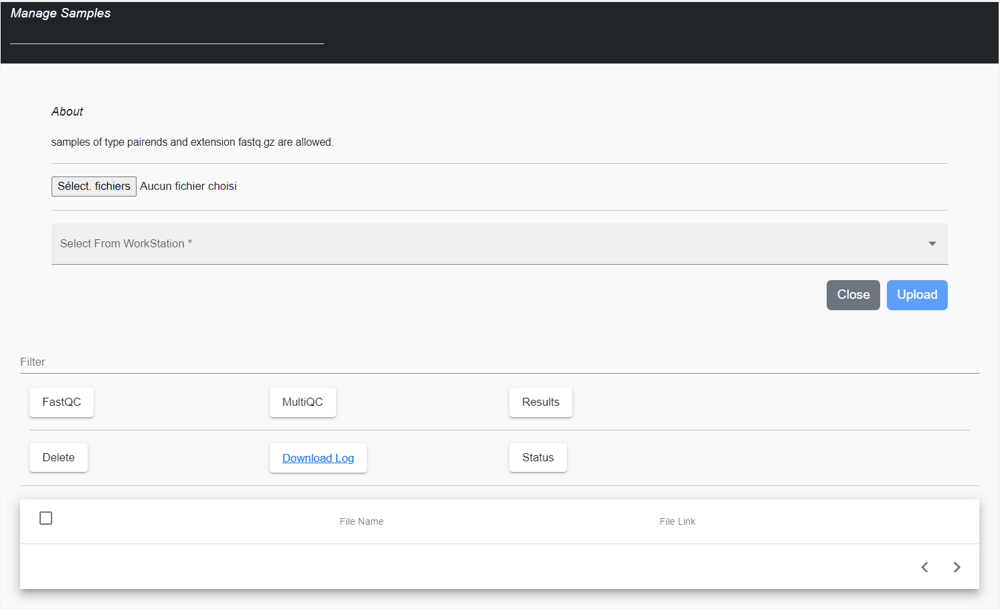

DREPAL-PATHOEXTRACT
===================

Création d'un compte utilisateur
~~~~~~~~~~~~~~~~~~~~~~~~~~~~~~~~

Bienvenue sur notre application !

Pour commencer à l'utiliser, vous devez d'abord créer un compte. Cela ne prend que quelques instants.

Création de compte
------------------

   
Pour créer un compte, suivez ces étapes simples :
1. Sur la page d'accueil de l'application, cliquez sur le bouton ``Create``.
2. Vous serez redirigé vers une page de création de compte.
3. Remplissez les informations suivantes :
   - Nom
   - Adresse électronique
   - Mot de passe de votre choix
4. Choisissez le profil qui vous convient le mieux parmi les options suivantes :
   - Bio-informatique
   - Biologie
   - Programmation
   Cette information nous permettra de personnaliser votre expérience utilisateur et de vous proposer du contenu adapté à vos besoins. 
5. Une fois que vous avez rempli tous les champs requis, cliquez sur le bouton ``Sign up now``.
6. Votre compte sera créé et vous pourrez vous connecter à l'application en utilisant votre adresse électronique et votre mot de passe.

Mot de passe oublié
-------------------

   
Si vous oubliez votre mot de passe, suivez ces étapes :

1. Sur l'interface de connexion, cliquez sur le bouton ``Forgot Password?``
2. Entrez votre adresse électronique associée à votre compte.
3. Si l'adresse électronique est associée à un compte existant, un e-mail contenant votre nouveau mot de passe vous sera envoyé.

Nous espérons que vous apprécierez votre expérience sur notre application ! Si vous avez des questions ou des problèmes, n'hésitez pas à nous contacter.
*Note : Assurez-vous de garder votre mot de passe en sécurité et de ne pas le partager avec d'autres personnes.*

Connexion à l'application
~~~~~~~~~~~~~~~~~~~~~~~~~

.. image:: ../pictures/-21824.png
   :scale: 15%
   :alt: forgot
   
   
Une fois que vous vous êtes connecté, vous serez accueilli par l'interface utilisateur de l'application. Celle-ci affichera votre nom en session pour vous indiquer que vous êtes connecté avec succès. En fonction de votre profil, vous aurez accès à différentes actions et onglets.
Maintenant que vous êtes connecté, vous avez accès à l'interface utilisateur de l'application. Dans les lignes qui suivent, nous allons vous présenter les différents onglets et actions que vous pouvez effectuer dans cette partie.

Fonctionnalités générales 
~~~~~~~~~~~~~~~~~~~~~

.. rubric:: Importer les fichiers 
 

   
 La fonctionnalité d'importation de fichiers de génomes de référence est disponible dans notre application. Pour importer un fichier de génome de référence, vous pouvez commencer par cliquer sur le bouton `Parcourir` qui vous permettra de sélectionner le ou les fichiers que vous souhaitez importer. Nous prenons en charge les extensions de fichiers couramment utilisées pour les fichiers de génomes de référence telles que `.fasta`, `.fa`, `.fna`, `.ffn`, `.faa`, `.frn` et `.gbk`. Il est important de noter que si vous changez d'avis ou que vous sélectionnez le mauvais fichier, le bouton `Close` vous permettra d'annuler la sélection des fichiers. De cette manière, vous pouvez vous assurer que vous importez les fichiers de génomes de référence appropriés pour vos analyses.

Une fois que vous avez sélectionné le ou les fichiers, vous pouvez cliquer sur le bouton `Upload` pour charger les fichiers dans l'application. Vous serez informé de la progression du téléchargement et une fois terminé, vous verrez une confirmation de réussite. À partir de là, les fichiers de génomes de référence peuvent être utilisés dans les traitements ultérieurs de l'application, tels que l'indexation et la suppression des fichiers si nécessaire.

Filter 
 
Figure 7 : Champs filter
Le champ "Filter" dans notre application est un outil de recherche très utile qui permet de rechercher des fichiers de génomes de référence en fonction de divers critères, tels que le nom de fichier, l'extension de fichier, la date de modification ou même la taille du fichier.
Par exemple, si vous recherchez un fichier spécifique, vous pouvez simplement saisir une partie de son nom ou de son extension dans le champ "Filter", et l'application affichera tous les fichiers correspondants à votre recherche.
De même, si vous avez besoin de trier les fichiers en fonction de leur taille ou de leur date de modification, vous pouvez simplement utiliser le champ "Filter" en spécifiant ces critères dans la recherche.
En somme, le champ "Filter" de notre application est un outil de recherche flexible et puissant qui permet aux utilisateurs de trouver rapidement et facilement les fichiers de génomes de référence dont ils ont besoin pour leur travail.
Le bouton Delete 
Le bouton "Delete" est une fonctionnalité importante de notre application qui permet de supprimer les fichiers sélectionnés dans la liste des répertoires. Pour utiliser cette fonctionnalité, vous pouvez d'abord sélectionner les fichiers que vous souhaitez supprimer en cochant les cases à côté des noms de fichiers dans la liste.
Une fois que vous avez sélectionné les fichiers à supprimer, vous pouvez cliquer sur le bouton "Delete" pour lancer le processus de suppression. Cette étape est importante car la suppression des fichiers est définitive et il ne sera pas possible de récupérer les fichiers supprimés.
Les fichiers seront supprimés de la liste des répertoires et de l'application. Cette fonctionnalité peut être très utile pour supprimer les fichiers obsolètes ou inutiles, libérant ainsi de l'espace disque pour de nouveaux fichiers à importer.

Le bouton Status	
Le bouton "Status" nous permet de savoir si un processus s'est bien déroulé ou non. Ce bouton affiche trois couleurs différentes pour indiquer l'état du processus : rouge, jaune et vert.
La couleur rouge indique que le processus ne s'est pas bien déroulé, souvent en raison d'une erreur système. Par exemple, cela peut être dû à un fichier qui n'est pas correctement formaté ou qui ne peut pas être trouvé. Si vous rencontrez une erreur rouge, il est recommandé de télécharger le fichier journal associé pour voir le détail de l'erreur et déterminer la cause du problème.
La couleur jaune indique que le processus s'est bien déroulé mais pas à 100%. Cela peut indiquer que vous êtes en train de retraiter les mêmes fichiers ou que certains fichiers ont été ignorés. Il est également conseillé de vérifier les journaux associés pour obtenir plus d'informations sur les fichiers traités.
Enfin, la couleur verte indique que le processus s'est bien déroulé à 100% et que toutes les opérations ont été effectuées avec succès. Il n'y a pas besoin de vérifier les journaux associés dans ce cas.
Le bouton "Status" est un moyen facile de vérifier l'état des processus et de savoir si tout s'est bien passé. Il est important de noter que les journaux associés fournissent des informations détaillées pour aider à résoudre les erreurs et les problèmes éventuels.

Le bouton Download Log
Ce bouton est une fonctionnalité très utile de notre application. En effet, il permet de visualiser toutes les opérations qui ont été effectuées lors des différents processus de l'application. En cliquant sur ce bouton, un fichier texte sera téléchargé directement depuis le navigateur.
Le fichier log contient toutes les informations relatives aux opérations effectuées dans l'application, y compris les erreurs et les avertissements. Il peut donc être très utile pour diagnostiquer les problèmes et les erreurs qui peuvent survenir lors des processus de traitement de données.
Il est important de noter que les fichiers logs sont généralement volumineux. Il est donc recommandé de prendre des mesures de sécurité appropriées pour stocker et gérer ces fichiers.

 
Figure 8 : Fonctionnalité générale

Génome de références 
La partie "Génome de référence" de notre application est une section importante pour le traitement des données génomiques. Elle permet de stocker les génomes de référence et de les charger facilement pour une utilisation ultérieure dans les différentes analyses génomiques. Ces génomes de référence peuvent être indexés pour une recherche rapide et efficace des séquences spécifiques.
Notre application offre également la possibilité de supprimer des génomes de référence en cas de besoin, que ce soit pour libérer de l'espace de stockage ou pour mettre à jour les données. La gestion efficace de ces génomes de référence est essentielle pour assurer la qualité et la précision des analyses génomiques.

Analyses des échantillons 
~~~~~~~~~~~~~~~~~~~~~~~~~

Manage samples 
 
Figure 12 : Interface manage samples
a-	Importer les fichiers 
La session "Manage Samples" permet, comme son nom l'indique, de charger les fichiers dans différents dossiers en fonction du traitement à effectuer. Dans le répertoire "Files to All Step", les fichiers chargés pourront être disponibles dans toutes les analyses. Ce répertoire peut contenir tous les types de fichiers générés par le séquençage de l'ADN tels que les fichiers en Fastq, Fq, en Fastq.gz ou Fq.gz.
Le dossier "Files to Run Double Filtering" ne doit contenir que des fichiers en Fq.gz pour pouvoir effectuer la double soustraction. Quant au dossier "Files to Generate De Novo", il ne doit contenir que des fichiers en Fastq pour pouvoir effectuer la génération de novo.
Cette organisation permet une gestion efficace des fichiers et évite les erreurs de traitement.
b-	Le boutons fastQC
La session "Manage samples" de notre application offre une fonctionnalité intéressante pour visualiser les fichiers que vous avez chargés dans l'application, peu importe leur extension (que ce soit des fichiers paired-end ou single-end), grâce au bouton "FastQC". Ce dernier permet de traiter les fichiers que vous avez sélectionnés et de générer des fichiers HTML pour la visualisation des résultats. 
Lorsque vous cliquez sur le bouton "FastQC", l'application va procéder à une analyse de la qualité des fichiers que vous avez sélectionnés, en utilisant l'outil FastQC. Les résultats seront ensuite compilés sous forme de fichiers HTML, qui pourront être visualisés directement dans votre navigateur web.
Cette fonctionnalité est particulièrement utile pour évaluer la qualité de vos données avant de les utiliser dans d'autres analyses, telles que l'assemblage de génome ou l'alignement de séquences. Elle vous permet de détecter rapidement les éventuels problèmes de qualité de vos fichiers, tels que des erreurs de séquençage ou une contamination par des séquences étrangères.
c-	Le bouton MultiQC
Le bouton MultiQC disponible dans la session Manage Samples nous permet de générer des rapports d'analyse de qualité pour un ensemble de fichiers de données. Le fonctionnement de ce bouton est similaire à celui de FastQC. En effet, après avoir sélectionné les fichiers à traiter, le bouton MultiQC les analysera pour en extraire les informations de qualité. Il créera ensuite un rapport global qui présentera les résultats sous forme graphique pour une meilleure compréhension.
MultiQC est particulièrement utile pour la visualisation de résultats provenant de multiples échantillons ou de différentes plates-formes de séquençage. Il permet ainsi de générer des rapports comparatifs pour différentes analyses. Ce bouton peut être utilisé pour des analyses de RNA-Seq, de ChIP-Seq, de métagénomique, entre autres.

Quality Control
 
Figure 13 : Interface contrôle de qualité
La session Quality Control permet de nettoyer les échantillons avant de passer à l'étape suivante de l'analyse. Cette étape est cruciale car elle permet de s'assurer de la qualité des données avant de les utiliser pour des analyses plus poussées. Après avoir visualisé les fichiers avec FastQC et MultiQC, cette session permet de gérer différents paramètres (création, mise à jour et suppression) et de les rappeler pour traiter les fichiers chargés dans le dossier File to All Step.
Le bouton Control Qualité de cette session exécute l'outil TrimGalore pour nettoyer les fichiers d'échantillons. TrimGalore est un outil de qualité qui est utilisé pour nettoyer les fichiers d'échantillons en éliminant les mauvais reads, en supprimant les duplicatas, etc. Il est conçuControl Quality traite les fichiers d'échantillons pair-end et permet de couper les mauvais reads.
La session Quality Control permet de garantir que les échantillons utilisés dans les analyses sont de la meilleure qualité possible en nettoyant les données brutes. Cela permet de s'assurer que les résultats obtenus par la suite seront fiables et précis.
Double digital filtering
 
Figure 14 : Interface Double digital filtering
La session Double Digital Filtering consiste en effet à extraire le génome du pathogène d'intérêt à partir des échantillons provenant de l'hôte humain. Cela se fait en filtrant les séquences par paire-end pour éliminer les séquences de mauvaise qualité et en utilisant les génomes de référence déjà indexés depuis la session Genome de Références pour aligner les séquences sur le génome ciblé. Le résultat final de cette session est le fichier pathomapped contenant les pathogènes extraits de l'hôte qui ont bien mappé sur le génome du pathogène d'intérêt. Avant l'exécution du traitement de la session Double Digital Filtering, il est nécessaire de sélectionner dans les listes déroulantes l'hôte et le pathogène d'étude. Cela permet de s'assurer que le traitement est adapté aux spécificités de chaque étude et d'obtenir des résultats précis et fiables.
Pipeline
 
Figure 15 : Interface de la session pipeline
Generate assembly and/or consensus.

