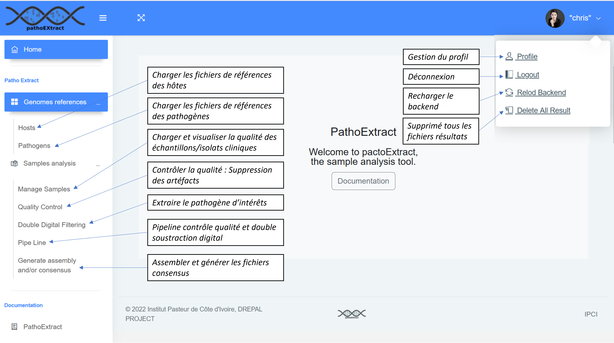
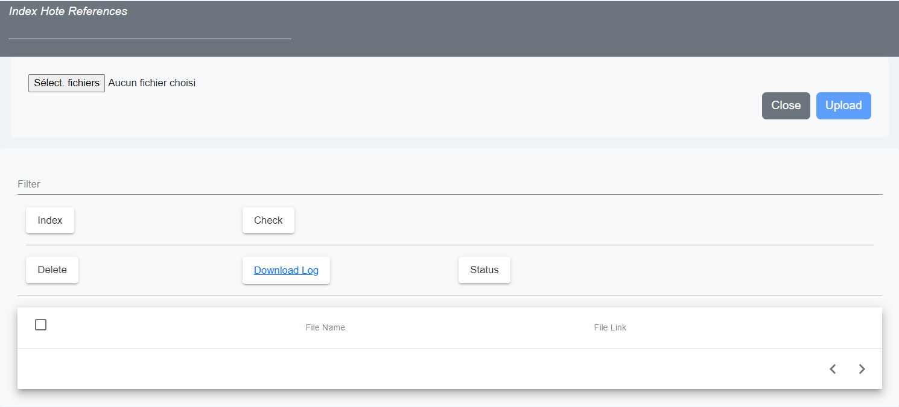
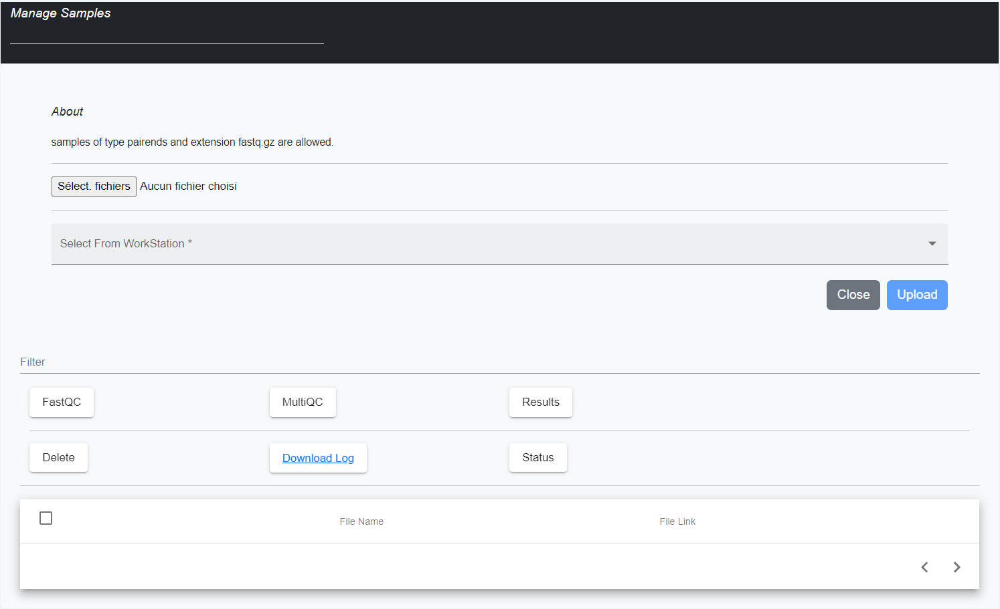
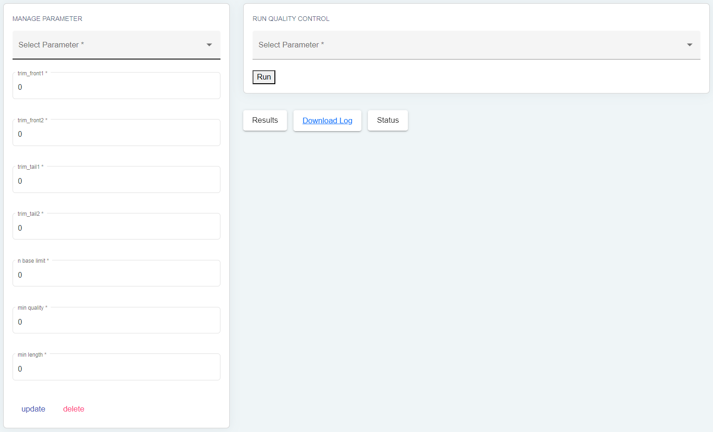
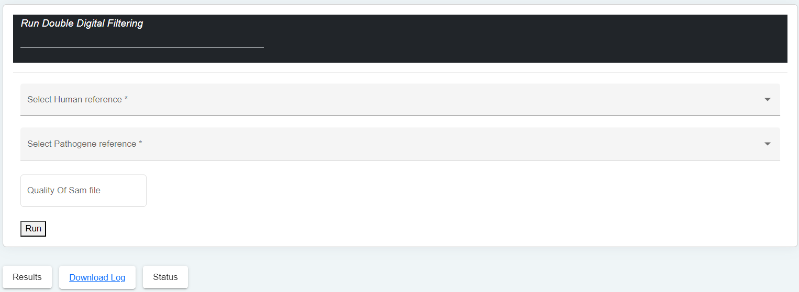
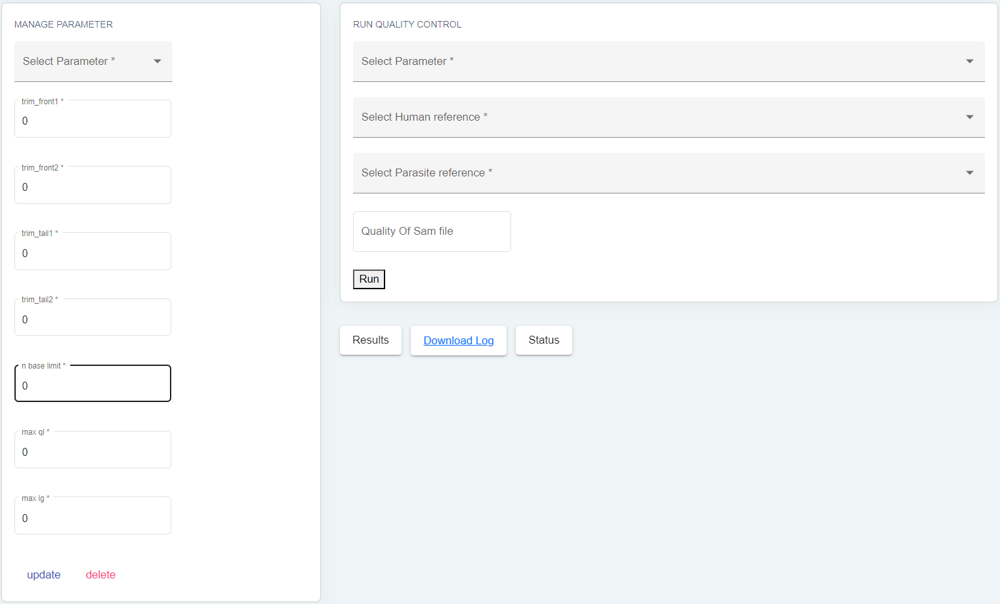
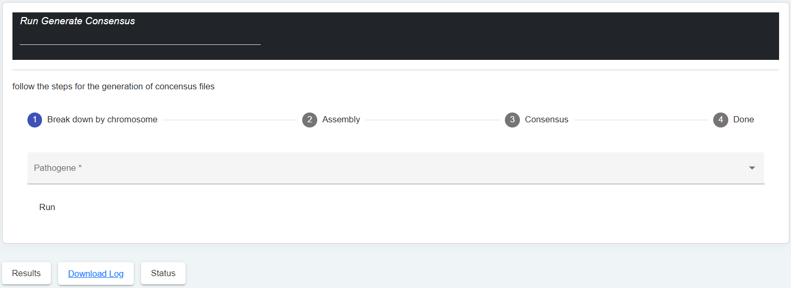
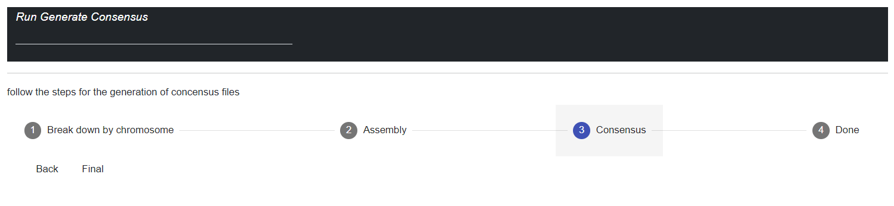
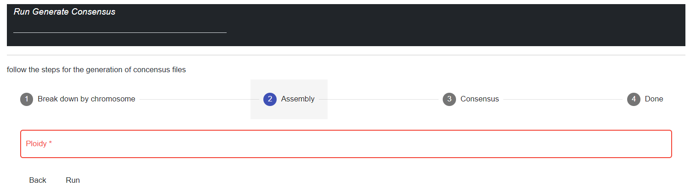
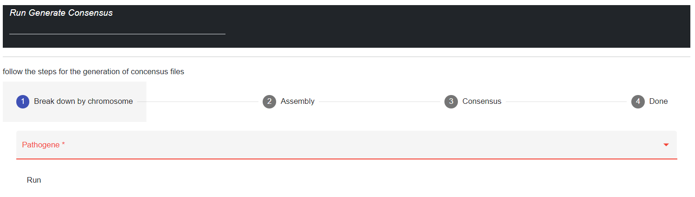

Fonctionnalités Générales
=========================

Charger les fichiers de références des hôtes / pathogènes
---------------------------------------------------------

La fonctionnalité d'importation de fichiers de génomes de référence est disponible dans notre application. Pour importer un fichier de génome de référence, vous pouvez commencer par cliquer sur le bouton ``'Parcourir"`` qui vous permettra de sélectionner le ou les fichiers que vous souhaitez importer. Nous prenons en charge les extensions de fichiers couramment utilisées pour les fichiers de génomes de référence telles que ``.fasta``, ``.fa``, ``.fna``, ``.ffn``, ``.faa``, ``.frn`` et ``.gbk``. 

Il est important de noter que si vous changez d'avis ou que vous sélectionnez le mauvais fichier, le bouton ``'Close'`` vous permettra d'annuler la sélection des fichiers. De cette manière, vous pouvez vous assurer que vous importez les fichiers de génomes de référence appropriés pour vos analyses.

Une fois que vous avez sélectionné le ou les fichiers, vous pouvez cliquer sur le bouton ``'Upload'`` pour charger les fichiers dans l'application. Vous serez informé de la progression du téléchargement et une fois terminé, vous verrez une confirmation de réussite.

À partir de là, les fichiers de génomes de référence peuvent être utilisés dans les traitements ultérieurs de l'application, tels que l'indexation et la suppression des fichiers si nécessaire.

.. rubric:: Le bouton index

L'indexation des fichiers de génomes de référence est une étape cruciale avant leur utilisation dans les traitements de l'application. Nous avons inclus une fonctionnalité d'indexation dans notre application.

Pour indexer un fichier de génome de référence, vous devez d'abord le charger dans l'application via l'importation. Ensuite, sélectionnez le fichier et cliquez sur le bouton "Index". Vous serez informé de la progression de l'indexation et recevrez une confirmation de réussite.

Veuillez noter que l'indexation peut prendre du temps en fonction de la taille du fichier et de la puissance de votre ordinateur. Une fois l'indexation terminée, vous pourrez utiliser le fichier dans les traitements ultérieurs de l'application pour une analyse plus rapide et efficace.

.. rubric:: Le bouton check

Le bouton "Check" permet de vérifier si un fichier de génome de référence a déjà été indexé dans l'application. Cette fonctionnalité évite de réindexer un fichier déjà présent, permettant ainsi d'économiser du temps. En cliquant sur le bouton "Check", s'il a déjà été indexé, le bouton devient vert pour indiquer que l'indexation est présente et peut être utilisée dans les traitements ultérieurs. S'il n'a pas été indexé, le bouton devient rouge et l'utilisateur est invité à cliquer sur le bouton "Indexer" pour créer l'index avant de pouvoir l'utiliser dans les traitements ultérieurs.

Charger et visualiser la qualité des échantillons/isolats cliniques
-------------------------------------------------------------------

La session "Manage Samples" permet, comme son nom l'indique, de charger les fichiers dans différents dossiers en fonction du traitement à effectuer.

Dans le répertoire **Files to All Step**, les fichiers chargés pourront être disponibles dans toutes les analyses. Ce répertoire peut contenir tous les types de fichiers générés par le séquençage de l'ADN tels que les fichiers en *Fastq*, *Fq*, en *Fastq.gz* ou *Fq.gz*.

Le dossier **Files to Run Double Filtering** ne doit contenir que des fichiers en *Fq.gz* pour pouvoir effectuer la double soustraction. Quant au dossier **Files to Generate De Novo**, il ne doit contenir que des fichiers en *Fastq* pour pouvoir effectuer la génération de novo.

Cette organisation permet une gestion efficace des fichiers et évite les erreurs de traitement.

.. rubric:: Le boutons fastQC

La session "Manage samples" de notre application offre une fonctionnalité pour visualiser les fichiers chargés, quelle que soit leur extension, grâce au bouton "FastQC". Ce bouton permet d'analyser la qualité des fichiers sélectionnés à l'aide de FastQC et de générer des fichiers HTML pour la visualisation des résultats. Cette fonctionnalité est utile pour évaluer la qualité des données avant leur utilisation dans d'autres analyses, telles que l'assemblage de génome ou l'alignement de séquences, permettant ainsi de détecter les problèmes potentiels tels que les erreurs de séquençage ou la contamination.

.. rubric:: Le bouton MultiQC

Le bouton MultiQC dans la session Manage Samples génère des rapports d'analyse de qualité pour un ensemble de fichiers de données. Son fonctionnement est similaire à FastQC. Après avoir sélectionné les fichiers à traiter, MultiQC les analyse et extrait les informations de qualité. Il crée ensuite un rapport global présentant les résultats graphiquement.

MultiQC est particulièrement utile pour visualiser les résultats de plusieurs échantillons ou de différentes plates-formes de séquençage. Il génère des rapports comparatifs pour diverses analyses, telles que RNA-Seq, ChIP-Seq et métagénomique.

Contrôler la qualité : Suppression des artéfacts 
------------------------------------------------

 
La session Quality Control nettoie les échantillons avant l'analyse. Elle assure la qualité des données avant les analyses approfondies. Après avoir visualisé les fichiers avec FastQC et MultiQC, cette session gère les paramètres et exécute l'outil TrimGalore via le bouton Control Qualité. TrimGalore est utilisé pour éliminer les mauvais reads, les duplicatas, etc., et garantir des échantillons de qualité. La session assure des résultats fiables et précis.

Extraire le pathogène d’intérêts 
--------------------------------

La session Double Digital Filtering extrait le génome du pathogène d'intérêt à partir des échantillons de l'hôte humain. Elle filtre les séquences par paire-end pour éliminer les séquences de mauvaise qualité et les aligne sur le génome ciblé à l'aide des génomes de référence indexés. Le résultat est un fichier pathomapped contenant les pathogènes extraits qui correspondent au génome d'intérêt. Avant l'exécution, il est important de sélectionner l'hôte et le pathogène pour obtenir des résultats précis et fiables.

Pipeline contrôle qualité et double soustraction digital
--------------------------------------------------------

La partie Pipeline de notre application regroupe deux étapes essentielles : le Contrôle Qualité et la Double Soustraction Digitale.
En combinant ces deux étapes, le Pipeline garantit des données de haute qualité et extrait les pathogènes spécifiques pour une analyse plus poussée.

Assembler et générer les fichiers consensus 
-------------------------------------------

La partie "Assembler et générer les fichiers consensus" se déroule en trois étapes essentielles :

.. rubric:: 1. Eclater le génome du pathogene d'interêt 

Cette étape consiste à décomposer le génome du pathogène d'intérêt en fragments correspondant à chaque chromosome. Cela permet de préparer les données pour l'assemblage ultérieur.

.. rubric:: 2. Assemblage 

Dans cette étape, les fragments de séquences sont alignés et combinés pour reconstruire la séquence complète du génome. Il est important de prendre en compte la ploïdie du pathogène pour obtenir un assemblage précis.

.. rubric:: 3. Génération des consensus 

Une fois l'assemblage terminé, des fichiers consensus sont générés. Ils représentent la séquence la plus probable pour chaque position du génome, en prenant en compte les variations et les erreurs présentes dans les fragments de séquences.

Ces trois étapes permettent d'obtenir une représentation complète et fiable du génome du pathogène d'intérêt, facilitant ainsi les analyses ultérieures et les découvertes scientifiques.

Les autres fonctionnalités 
--------------------------

.. rubric:: Le champ filter 
 
Le champ ``"Filter"`` dans notre application est un outil de recherche très utile qui permet de rechercher des fichiers de génomes de référence en fonction de divers critères, tels que le nom de fichier, l'extension de fichier, la date de modification ou même la taille du fichier.
Par exemple, si vous recherchez un fichier spécifique, vous pouvez simplement saisir une partie de son nom ou de son extension dans le champ ``"Filter"``, et l'application affichera tous les fichiers correspondants à votre recherche.
De même, si vous avez besoin de trier les fichiers en fonction de leur taille ou de leur date de modification, vous pouvez simplement utiliser le champ ``"Filter"`` en spécifiant ces critères dans la recherche.
En somme, le champ ``"Filter"`` de notre application est un outil de recherche flexible et puissant qui permet aux utilisateurs de trouver rapidement et facilement les fichiers de génomes de référence dont ils ont besoin pour leur travail.

.. rubric:: Le bouton Delete 

Le bouton ``"Delete"`` est une fonctionnalité importante de notre application qui permet de supprimer les fichiers sélectionnés dans la liste des répertoires. Pour utiliser cette fonctionnalité, vous pouvez d'abord sélectionner les fichiers que vous souhaitez supprimer en cochant les cases à côté des noms de fichiers dans la liste.
Une fois que vous avez sélectionné les fichiers à supprimer, vous pouvez cliquer sur le bouton ``"Delete"`` pour lancer le processus de suppression. Cette étape est importante car la suppression des fichiers est définitive et il ne sera pas possible de récupérer les fichiers supprimés.
Les fichiers seront supprimés de la liste des répertoires et de l'application. Cette fonctionnalité peut être très utile pour supprimer les fichiers obsolètes ou inutiles, libérant ainsi de l'espace disque pour de nouveaux fichiers à importer.

.. rubric:: Le bouton Status	

Le bouton ``"Status"`` nous permet de savoir si un processus s'est bien déroulé ou non. Ce bouton affiche trois couleurs différentes pour indiquer l'état du processus : rouge, jaune et vert.
La couleur rouge indique que le processus ne s'est pas bien déroulé, souvent en raison d'une erreur système. Par exemple, cela peut être dû à un fichier qui n'est pas correctement formaté ou qui ne peut pas être trouvé. Si vous rencontrez une erreur rouge, il est recommandé de télécharger le fichier journal associé pour voir le détail de l'erreur et déterminer la cause du problème.
La couleur jaune indique que le processus s'est bien déroulé mais pas à 100%. Cela peut indiquer que vous êtes en train de retraiter les mêmes fichiers ou que certains fichiers ont été ignorés. Il est également conseillé de vérifier les journaux associés pour obtenir plus d'informations sur les fichiers traités.
Enfin, la couleur verte indique que le processus s'est bien déroulé à 100% et que toutes les opérations ont été effectuées avec succès. Il n'y a pas besoin de vérifier les journaux associés dans ce cas.
Le bouton ``"Status"`` est un moyen facile de vérifier l'état des processus et de savoir si tout s'est bien passé. Il est important de noter que les journaux associés fournissent des informations détaillées pour aider à résoudre les erreurs et les problèmes éventuels.

.. rubric:: Le bouton Download Log

Ce bouton est une fonctionnalité très utile de notre application. En effet, il permet de visualiser toutes les opérations qui ont été effectuées lors des différents processus de l'application. En cliquant sur ce bouton, un fichier texte sera téléchargé directement depuis le navigateur.
Le fichier log contient toutes les informations relatives aux opérations effectuées dans l'application, y compris les erreurs et les avertissements. Il peut donc être très utile pour diagnostiquer les problèmes et les erreurs qui peuvent survenir lors des processus de traitement de données.
Il est important de noter que les fichiers logs sont généralement volumineux. Il est donc recommandé de prendre des mesures de sécurité appropriées pour stocker et gérer ces fichiers.

